# Playwright Fixtures for Plugins

A comprehensive guide to using the `playwright-fixture-for-plugins` library for end-to-end testing of [Integration-Core](https://github.com/sequra/integration-core) plugins.

## Table of Contents

1. [Getting Started](#getting-started)
2. [Quick Setup](#quick-setup)
3. [Understanding the Architecture](#understanding-the-architecture)
4. [Your First Test](#your-first-test)
5. [Core Components Deep Dive](#core-components-deep-dive)
6. [Required Implementation](#required-implementation)
7. [Advanced Usage Examples](#advanced-usage-examples)
8. [Custom Extensions](#custom-extensions)
9. [Webhook System](#webhook-system)
10. [Best Practices](#best-practices)
11. [API Reference](#api-reference)

---

## Getting Started

### What is Playwright Fixtures for Plugins?

The `playwright-fixture-for-plugins` library is a specialized testing framework designed for end-to-end testing of Integration-Core plugins. Think of it as a testing toolkit that provides ready-made components for testing e-commerce payment plugins across different platforms.

### Key Benefits

- **🏗️ Standardized Architecture**: Consistent structure across different e-commerce platforms
- **🧩 Page Object Model**: Pre-built page interactions and element selectors
- **💳 Widget Testing**: Specialized support for payment widgets and promotional elements
- **📊 Data Management**: Centralized test data for different scenarios and countries
- **⚙️ Backend Automation**: Programmatic configuration without manual admin panel setup

### Who Should Use This?

- QA Engineers testing payment plugins
- Developers building e-commerce integrations
- Teams needing consistent testing across multiple platforms (Magento, WooCommerce, etc.)

---

## Quick Setup

### Step 1: Installation

Add the library to your project:

```json
{
  "devDependencies": {
    "@playwright/test": "^1.49.1",
    "playwright-fixture-for-plugins": "github:sequra/playwright-fixture-for-plugins"
  }
}
```

```bash
npm install
```

### Step 2: Environment Configuration

Set up required environment variables:

```bash
# .env file
PUBLIC_URL=http://localhost:8080
# Define extra variables for your platform that will be used in tests. For example:
ADMIN_USER=admin
ADMIN_PASSWORD=admin123
```

### Step 3: Playwright Configuration

```javascript
// playwright.config.js
import { defineConfig, devices } from '@playwright/test';

export default defineConfig({
  testDir: './tests-e2e/specs',
  timeout: 5 * 60 * 1000,
  use: {
    baseURL: process.env.PUBLIC_URL,
    trace: 'on-first-retry',
  },
  projects: [
    {
      name: 'checkout-tests',
      use: { ...devices['Desktop Chrome'] },
    }
  ]
});
```

### Step 4: Basic Project Structure

```
your-project/
├── tests-e2e/
│   ├── fixtures/
│   │   ├── test.js              # Main test fixture setup
│   │   ├── base/
│   │   │   └── BackOffice.js    # Your platform implementation
│   │   ├── pages/
│   │   │   ├── ProductPage.js   # Your platform implementation
│   │   │   └── CheckoutPage.js  # Your platform implementation
│   │   └── utils/
│   │       ├── DataProvider.js  # Your data customizations
│   │       └── SeQuraHelper.js  # Your webhook implementations
│   └── specs/
│       └── checkout.spec.js     # Your test files
├── playwright.config.js
└── package.json
```

---

## Understanding the Architecture

### Overview

The library uses an **abstract base class pattern** - it provides interfaces and common functionality, but requires you to implement platform-specific details.

```mermaid
graph TD
    A[🧪 Your Tests] --> B[🔧 Test Fixtures]
    B --> C[📄 Page Objects]
    B --> D[📊 Data Provider]
    B --> E[🔗 SeQura Helper]
    C --> F[🌐 E-commerce Platform]
    D --> F
    E --> G[📡 Webhook Endpoints]
    G --> F
    
    style A fill:#e3f2fd
    style B fill:#f3e5f5
    style F fill:#e8f5e8
```



### Component Hierarchy


---

## Your First Test

Let's start with a simple test to understand how everything works together.

### Step 1: Create Test Fixture Setup

```javascript
// tests-e2e/fixtures/test.js
import { test as baseTest, expect } from "@playwright/test";

// Import base classes from the library
import { 
  ConnectionSettingsPage, 
  GeneralSettingsPage, 
  PaymentMethodsSettingsPage 
} from "playwright-fixture-for-plugins";

// Import your platform implementations
import BackOffice from "./base/BackOffice.js";
import DataProvider from "./utils/DataProvider.js";
import SeQuraHelper from "./utils/SeQuraHelper.js";
import ProductPage from "./pages/ProductPage.js";
import CheckoutPage from "./pages/CheckoutPage.js";

const test = baseTest.extend({
  dataProvider: async ({ page, baseURL, request }, use) => 
    await use(new DataProvider(page, baseURL, expect, request)),
  backOffice: async ({ page, baseURL }, use) => 
    await use(new BackOffice(page, baseURL, expect)),
  helper: async ({ page, baseURL, request }, use) => 
    await use(new SeQuraHelper(page, baseURL, expect, request)),
  productPage: async ({ page, baseURL, request }, use) => 
    await use(new ProductPage(page, baseURL, expect, request)),
  checkoutPage: async ({ page, baseURL, request }, use) => 
    await use(new CheckoutPage(page, baseURL, expect, request)),
});

export { test, expect };
```

### Step 2: Write Your First Test

```javascript
// tests-e2e/specs/basic-checkout.spec.js
import { test } from '../fixtures/test.js';

test.describe('Basic Checkout Flow', () => {
  test('Customer can complete a purchase', async ({ 
    helper, dataProvider, productPage, checkoutPage 
  }) => {
    // 1. Setup test environment via webhook
    await helper.executeWebhook({ webhook: 'dummy_config' });
    
    // 2. Get test data
    const shopper = dataProvider.shopper('spain');
    
    // 3. Add product to cart
    await productPage.addToCart({ 
      slug: 'simple-product', 
      quantity: 1 
    });
    
    // 4. Complete checkout
    await checkoutPage.goto();
    await checkoutPage.fillForm(shopper);
    await checkoutPage.placeOrder({ ...shopper, product: 'i1' });
    
    // 5. Verify success
    await checkoutPage.waitForOrderSuccess();
  });
});
```

### ⚠️ This Won't Work Yet!

If you run this test now, you'll get `"Not implemented"` errors. That's by design! The library requires you to implement platform-specific logic.

---

## Core Components Deep Dive

### 1. Fixture Base Class

Every component extends from this foundational class:

```javascript
export default class Fixture {
    constructor(page, baseURL, expect) {
        this.page = page;        // Playwright page object
        this.baseURL = baseURL;  // Your app's base URL
        this.expect = expect;    // Playwright expect function
        this.selectors = this.initSelectors();  // CSS selectors
        this.locators = this.initLocators();    // Playwright locators
    }

    initSelectors() { return {}; }  // Override with your selectors
    initLocators() { return {}; }   // Override with your locators
}
```

### 2. DataProvider

Centralized test data management:

```javascript
// Available methods
dataProvider.shopper('spain')           // Spanish customer data
dataProvider.shopper('france')          // French customer data  
dataProvider.shopper('approve')         // Auto-approval scenario
dataProvider.shopper('cancel')          // Auto-cancel scenario
dataProvider.checkoutPaymentMethods()   // Available payment options
dataProvider.widgetOptions()            // Widget configuration
dataProvider.publicIP()                 // Current public IP
```

### 3. SeQuraHelper

Backend webhook communication:

```javascript
// Execute configuration webhooks
await helper.executeWebhook({ webhook: 'dummy_config' });

// Execute with parameters
await helper.executeWebhook({ 
  webhook: 'configure_merchant',
  args: [
    { name: 'country', value: 'ES' },
    { name: 'merchant_ref', value: 'test_merchant' }
  ]
});
```

### 4. Page Objects

Specialized page interactions:

- **ProductPage**: Product detail page operations
- **CheckoutPage**: Checkout flow and payment processing
- **CartPage**: Shopping cart functionality
- **PageWithWidgets**: Widget testing capabilities
- **SettingsPage**: Admin configuration pages

---

## Required Implementation

### Why Abstract Methods?

The library uses abstract methods (that throw `"Not implemented"` errors) to:

- **🔒 Enforce Implementation**: You must provide platform-specific code
- **🔄 Maintain Consistency**: Same interface across all platforms
- **🎯 Stay Flexible**: No assumptions about your specific platform
- **🛡️ Type Safety**: Clear method signatures and expectations

### What You Must Implement

#### BackOffice Class

```javascript
// base/BackOffice.js
import { BackOffice as BaseBackOffice } from 'playwright-fixture-for-plugins';

export default class BackOffice extends BaseBackOffice {
  initLocators() {
    return {
      usernameInput: () => this.page.locator('#username'),
      passwordInput: () => this.page.locator('#password'),
      loginButton: () => this.page.locator('.login-button'),
      sequraMenuLink: () => this.page.locator('[data-menu="sequra"]'),
    };
  }

  async login(options = {}) {
    // YOUR IMPLEMENTATION: How to log into your platform's admin
    const { usernameInput, passwordInput, loginButton } = this.locators;
    
    await this.page.goto(`${this.baseURL}/admin`);
    await usernameInput().fill(process.env.ADMIN_USER);
    await passwordInput().fill(process.env.ADMIN_PASSWORD);
    await loginButton().click();
  }

  async logout(options = {}) {
    // YOUR IMPLEMENTATION: How to log out
    await this.page.context().clearCookies();
  }

  async gotoSeQuraSettings(options = { page: '' }) {
    // YOUR IMPLEMENTATION: Navigate to plugin settings
    await this.login();
    await this.locators.sequraMenuLink().click();
    if (options.page) {
      await this.page.click(`[data-tab="${options.page}"]`);
    }
  }

  async gotoOrderListing(options = {}) {
    // YOUR IMPLEMENTATION: Navigate to orders page
    await this.login();
    await this.page.goto(`${this.baseURL}/admin/orders`);
  }
}
```

#### ProductPage Class

```javascript
// pages/ProductPage.js
import { ProductPage as BaseProductPage } from "playwright-fixture-for-plugins";

export default class ProductPage extends BaseProductPage {
  productUrl(options) {
    // YOUR IMPLEMENTATION: How to generate product URLs
    const { slug } = options;
    return `${this.baseURL}/products/${slug}`;
  }

  qtyLocator(options = {}) {
    // YOUR IMPLEMENTATION: Quantity input selector
    return this.page.locator('input[name="qty"]');
  }

  addToCartLocator(options = {}) {
    // YOUR IMPLEMENTATION: Add to cart button selector
    return this.page.locator('.add-to-cart-btn');
  }

  async expectProductIsInCart(options = {}) {
    // YOUR IMPLEMENTATION: How to verify product was added
    await this.page.locator('.cart-success-message').waitFor();
  }
}
```

#### SeQuraHelper Class

```javascript
// utils/SeQuraHelper.js
import { SeQuraHelper as BaseSeQuraHelper } from "playwright-fixture-for-plugins";

export default class SeQuraHelper extends BaseSeQuraHelper {
  initWebhooks() {
    // YOUR IMPLEMENTATION: Define available webhooks
    return {
      dummy_config: 'dummy_config',
      reset_state: 'reset_state',
      setup_widgets: 'setup_widgets',
      simulate_payment: 'simulate_payment'
    };
  }
}
```

#### DataProvider Class

```javascript
// utils/DataProvider.js
import { DataProvider as BaseDataProvider } from "playwright-fixture-for-plugins";

export default class DataProvider extends BaseDataProvider {
  // YOUR IMPLEMENTATION: Widget configuration methods
  i1FrontEndWidgetOptions = (options = {}) => {
    const { amount = 100, registrationAmount = null } = options;
    return this.frontEndWidgetOptions('i1', null, amount, registrationAmount);
  }

  pp3FrontEndWidgetOptions = (options = {}) => {
    const { amount = 100, registrationAmount = null } = options;
    return this.frontEndWidgetOptions('pp3', null, amount, registrationAmount);
  }

  sp1FrontEndWidgetOptions = (options = {}) => {
    const { amount = 100, registrationAmount = null } = options;
    return this.frontEndWidgetOptions('sp1', null, amount, registrationAmount);
  }
}
```

### Implementation Checklist

**For BackOffice:**
- [ ] `login(options)` - Platform authentication
- [ ] `logout(options)` - Session cleanup  
- [ ] `gotoSeQuraSettings(options)` - Navigate to plugin settings
- [ ] `gotoOrderListing(options)` - Navigate to orders

**For ProductPage:**
- [ ] `productUrl(options)` - URL generation
- [ ] `qtyLocator(options)` - Quantity selector
- [ ] `addToCartLocator(options)` - Add to cart selector
- [ ] `expectProductIsInCart(options)` - Cart validation

**For SeQuraHelper:**
- [ ] `initWebhooks()` - Available webhooks

**For DataProvider:**
- [ ] `i1FrontEndWidgetOptions(options)` - i1 widget config
- [ ] `pp3FrontEndWidgetOptions(options)` - pp3 widget config  
- [ ] `sp1FrontEndWidgetOptions(options)` - sp1 widget config

---

## Advanced Usage Examples

### Complete E-commerce Flow Test

```javascript
test('End-to-end purchase flow', async ({ 
  helper, dataProvider, productPage, checkoutPage, backOffice 
}) => {
  // Setup environment
  await helper.executeWebhook({ webhook: 'dummy_config' });
  const shopper = dataProvider.shopper('spain');

  // Product interaction
  await productPage.addToCart({ slug: 'premium-product', quantity: 2 });
  
  // Checkout process
  await checkoutPage.goto();
  await checkoutPage.fillForm(shopper);
  
  // Test payment method visibility
  const paymentMethods = dataProvider.checkoutPaymentMethods();
  for (const method of paymentMethods) {
    await checkoutPage.expectPaymentMethodToBeVisible(method);
  }
  
  // Complete purchase
  await checkoutPage.placeOrder({ ...shopper, product: 'i1' });
  await checkoutPage.waitForOrderSuccess();
  
  // Verify in admin
  await backOffice.gotoOrderListing();
  await checkoutPage.expectOrderHasTheCorrectMerchantId('ES', helper, dataProvider);
});
```

### Widget Testing

```javascript
test('Payment widgets display correctly', async ({ 
  productPage, dataProvider 
}) => {
  // Test different widget configurations
  const widgetConfigs = [
    dataProvider.i1FrontEndWidgetOptions({ amount: 150 }),
    dataProvider.pp3FrontEndWidgetOptions({ amount: 150 }),
    dataProvider.sp1FrontEndWidgetOptions({ amount: 150 })
  ];

  await productPage.goto({ slug: 'test-product' });
  
  for (const config of widgetConfigs) {
    await productPage.expectWidgetToBeVisible(config);
  }
});

test('Mini widgets in product listing', async ({ 
  categoryPage, dataProvider 
}) => {
  await categoryPage.goto({ category: 'electronics' });
  
  // Verify mini widgets appear for each product
  await categoryPage.expectAnyVisibleMiniWidget('pp3');
  await categoryPage.expectMiniWidgetsNotToBeVisible('invalid-product');
});
```

### Configuration Testing

```javascript
test('Admin configuration workflow', async ({ 
  backOffice, paymentMethodsSettingsPage, dataProvider 
}) => {
  const countries = dataProvider.countriesMerchantRefs();
  
  await backOffice.gotoSeQuraSettings({ page: 'payment_methods' });
  
  // Configure each country
  for (const country of countries) {
    await paymentMethodsSettingsPage.configureCountry(country);
    await paymentMethodsSettingsPage.save();
    await paymentMethodsSettingsPage.expectSaveSuccess();
  }
  
  // Verify configuration is applied
  await paymentMethodsSettingsPage.expectCountryConfiguration(countries[0]);
});
```

### Scenario Testing

```javascript
test.describe('Payment Scenarios', () => {
  test('Approved payment flow', async ({ helper, dataProvider, productPage, checkoutPage }) => {
    await helper.executeWebhook({ webhook: 'dummy_config' });
    const approvalShopper = dataProvider.shopper('approve');
    
    await productPage.addToCart({ slug: 'test-product', quantity: 1 });
    await checkoutPage.goto();
    await checkoutPage.fillForm(approvalShopper);
    await checkoutPage.placeOrder({ ...approvalShopper, product: 'i1' });
    
    await checkoutPage.waitForOrderSuccess();
    // Order should be automatically approved due to shopper name
  });

  test('Cancelled payment flow', async ({ helper, dataProvider, productPage, checkoutPage }) => {
    await helper.executeWebhook({ webhook: 'dummy_config' });
    const cancelShopper = dataProvider.shopper('cancel');
    
    await productPage.addToCart({ slug: 'test-product', quantity: 1 });
    await checkoutPage.goto();
    await checkoutPage.fillForm(cancelShopper);
    await checkoutPage.placeOrder({ ...cancelShopper, product: 'i1' });
    
    await checkoutPage.waitForOrderSuccess();
    // Order should be automatically cancelled due to shopper name
  });
});
```

---

## Custom Extensions

### Adding Custom Data

```javascript
// utils/DataProvider.js - Add custom methods
export default class DataProvider extends BaseDataProvider {
  // ... required implementations ...

  // Custom shopper profiles
  enterpriseCustomer() {
    return {
      email: 'enterprise@company.com',
      firstName: 'Enterprise',
      lastName: 'Customer',
      company: 'Big Corp Inc',
      vatNumber: 'ES12345678Z',
      // ... additional fields
    };
  }

  // Custom payment configurations
  customPaymentMethods() {
    return [
      { title: 'Custom Payment Option', product: 'custom', checked: false },
      { title: 'Special Financing', product: 'special', checked: true }
    ];
  }
}
```

### Adding Custom Page Objects

```javascript
// pages/CartPage.js
import { CartPage as BaseCartPage } from "playwright-fixture-for-plugins";

export default class CartPage extends BaseCartPage {
  initLocators() {
    return {
      ...super.initLocators(),
      cartItems: () => this.page.locator('.cart-item'),
      totalAmount: () => this.page.locator('.cart-total'),
      promoCodeInput: () => this.page.locator('#promo-code'),
      applyPromoButton: () => this.page.locator('.apply-promo'),
    };
  }

  async applyPromoCode(code) {
    await this.locators.promoCodeInput().fill(code);
    await this.locators.applyPromoButton().click();
  }

  async expectItemCount(count) {
    await this.expect(this.locators.cartItems()).toHaveCount(count);
  }
}
```

### Custom Helper Methods

```javascript
// utils/SeQuraHelper.js - Add convenience methods
export default class SeQuraHelper extends BaseSeQuraHelper {
  // ... required implementations ...

  async resetToCleanState() {
    await this.executeWebhook({ webhook: 'reset_state' });
    await this.executeWebhook({ webhook: 'dummy_config' });
  }

  async configureForCountry(countryCode) {
    await this.executeWebhook({ 
      webhook: 'configure_merchant',
      args: [
        { name: 'country', value: countryCode },
        { name: 'environment', value: 'sandbox' }
      ]
    });
  }

  async simulatePaymentStatus(orderId, status) {
    await this.executeWebhook({
      webhook: 'simulate_payment',
      args: [
        { name: 'order_id', value: orderId },
        { name: 'status', value: status }
      ]
    });
  }
}
```

---

## Webhook System

### Understanding Webhooks

The webhook system is the bridge between your tests and your e-commerce platform's backend. Instead of manually configuring settings through admin panels, tests send HTTP requests to configure the environment programmatically.

### How It Works


### Required E-commerce Implementation

Your e-commerce platform needs to handle webhook requests:

```php
// Example PHP implementation
<?php
if (isset($_GET['sq-webhook'])) {
    $webhook = $_GET['sq-webhook'];
    $params = $_GET;
    unset($params['sq-webhook']);
    
    $handler = new SeQuraTestWebhookHandler();
    echo $handler->handle($webhook, $params);
    exit;
}

class SeQuraTestWebhookHandler {
    public function handle($webhook, $params) {
        try {
            switch ($webhook) {
                case 'dummy_config':
                    return $this->setupDummyConfig($params);
                case 'reset_state':
                    return $this->resetState($params);
                case 'simulate_payment':
                    return $this->simulatePayment($params);
                default:
                    http_response_code(400);
                    return json_encode(['status' => 'error', 'message' => 'Unknown webhook']);
            }
        } catch (Exception $e) {
            http_response_code(500);
            return json_encode(['status' => 'error', 'message' => $e->getMessage()]);
        }
    }
    
    private function setupDummyConfig($params) {
        // Configure plugin with test credentials
        $this->configManager->setTestMode(true);
        $this->configManager->setMerchantCredentials('dummy_automated_tests');
        
        // Enable widgets if requested
        if (isset($params['widgets']) && $params['widgets'] == '1') {
            $this->configManager->enableWidgets();
        }
        
        return json_encode(['status' => 'success']);
    }
    
    private function resetState($params) {
        // Reset to default configuration
        $this->configManager->resetToDefaults();
        return json_encode(['status' => 'success']);
    }
    
    private function simulatePayment($params) {
        $orderId = $params['order_id'] ?? null;
        $status = $params['status'] ?? 'approved';
        
        if ($orderId) {
            $this->orderManager->updatePaymentStatus($orderId, $status);
        }
        
        return json_encode(['status' => 'success', 'order_id' => $orderId]);
    }
}
?>
```

### Webhook URL Format

```
POST {baseURL}/?sq-webhook={webhook_name}&param1=value1&param2=value2
```

Examples:
```
POST https://shop.local/?sq-webhook=dummy_config&widgets=1
POST https://shop.local/?sq-webhook=simulate_payment&order_id=123&status=approved
POST https://shop.local/?sq-webhook=configure_merchant&country=ES&merchant_ref=test_es
```

---

## Best Practices

### 1. Test Organization

```javascript
// ✅ Good: Organized by feature
test.describe('Payment Widget Tests', () => {
  test.beforeEach(async ({ helper }) => {
    await helper.executeWebhook({ webhook: 'dummy_config' });
  });

  test('Product page widget visibility', async ({ productPage, dataProvider }) => {
    // Test implementation
  });

  test('Cart page widget functionality', async ({ cartPage, dataProvider }) => {
    // Test implementation
  });
});

// ❌ Bad: Mixed concerns
test.describe('All Tests', () => {
  test('test everything', async ({ allFixtures }) => {
    // Too much in one test
  });
});
```

### 2. Data Management

```javascript
// ✅ Good: Use DataProvider
const shopper = dataProvider.shopper('spain');
const paymentMethods = dataProvider.checkoutPaymentMethods();

// ❌ Bad: Hardcoded data
const shopper = {
  email: 'test@test.com',
  firstName: 'Test',
  // ... hardcoded values
};
```

### 3. Error Handling

```javascript
// ✅ Good: Proper error context
async expectProductIsInCart(options = {}) {
  try {
    await this.locators.successMessage().waitFor({ timeout: 10000 });
  } catch (error) {
    throw new Error(`Product was not added to cart. ${error.message}`);
  }
}

// ❌ Bad: Generic errors
async expectProductIsInCart() {
  await this.locators.successMessage().waitFor();
}
```

### 4. Waiting Strategies

```javascript
// ✅ Good: Explicit waits
await this.page.waitForSelector('.payment-methods', { state: 'visible' });
await this.page.waitForLoadState('networkidle');

// ❌ Bad: Fixed delays
await this.page.waitForTimeout(5000);
```

### 5. Page Object Design

```javascript
// ✅ Good: Focused responsibilities
class ProductPage extends BaseProductPage {
  async addToCart(options) {
    await this.goto(options);
    await this.setQuantity(options.quantity);
    await this.clickAddToCart();
    await this.expectProductIsInCart();
  }
}

// ❌ Bad: Too many responsibilities
class MegaPage extends BasePage {
  async doEverything() {
    // Handles products, checkout, admin, etc.
  }
}
```

### 6. Environment Management

```javascript
// ✅ Good: Environment-specific configuration
const config = {
  baseURL: process.env.PUBLIC_URL,
  adminUser: process.env.ADMIN_USER,
  timeouts: {
    slow: process.env.CI ? 30000 : 10000,
    default: process.env.CI ? 15000 : 5000
  }
};

// ❌ Bad: Hardcoded values
const config = {
  baseURL: 'http://localhost:8080',
  adminUser: 'admin',
  // ...
};
```

---

## API Reference

### Core Classes

#### Fixture
Base class for all components:
```javascript
constructor(page, baseURL, expect)
initSelectors()     // Override: Return CSS selectors object
initLocators()      // Override: Return Playwright locators object
```

#### DataProvider
Test data management:
```javascript
shopper(alias)                          // Get customer data by alias
checkoutPaymentMethods(merchantRef)     // Get payment method configuration  
widgetOptions()                         // Get default widget configuration
countriesMerchantRefs(username)         // Get merchant references by country
publicIP()                              // Get current public IP address
deploymentTargetsOptions()              // Get deployment target options
```

#### SeQuraHelper
Webhook communication:
```javascript
executeWebhook(options)     // Execute backend webhook
getWebhookUrl(options)      // Generate webhook URL  
initWebhooks()             // Override: Define available webhooks
```

#### BackOffice
Admin panel operations:
```javascript
login(options)              // Override: Platform authentication
logout(options)             // Override: Session cleanup
gotoSeQuraSettings(options) // Override: Navigate to plugin settings  
gotoOrderListing(options)   // Override: Navigate to orders page
```

#### PageWithWidgets
Widget testing capabilities:
```javascript
expectWidgetToBeVisible(options)        // Assert widget visibility
expectWidgetNotToBeVisible(options)     // Assert widget absence
expectAnyVisibleMiniWidget(product)     // Assert mini widget presence
expectMiniWidgetsNotToBeVisible(product) // Assert mini widget absence
```

### Data Types

#### Shopper Data
```javascript
{
  email: string,
  firstName: string,
  lastName: string,
  address1: string,
  country: string,
  city: string,
  state: string,
  postcode: string,
  phone: string,
  dateOfBirth: string,
  nin: string,
  creditCard: {
    number: string,
    exp: string,
    cvc: string
  },
  otp: string[]
}
```

#### Widget Options
```typescript
interface FrontEndWidgetOptions {
  locationSel: string;      // CSS selector for widget location
  widgetConfig: string;     // Widget styling configuration JSON
  product: string;          // Product type (i1, pp3, sp1)
  amount: number;           // Transaction amount
  registrationAmount?: number;  // Registration amount (optional)
  campaign?: string;        // Campaign identifier (optional)
}

interface WidgetOptions {
  widgetConfig: string;           // JSON configuration
  product: WidgetOptionsProduct;  // Product page settings
  cart: WidgetOptionsCart;        // Cart page settings
  productListing: WidgetOptionsProductListing; // Listing page settings
}
```

---

Happy testing! 🎉
